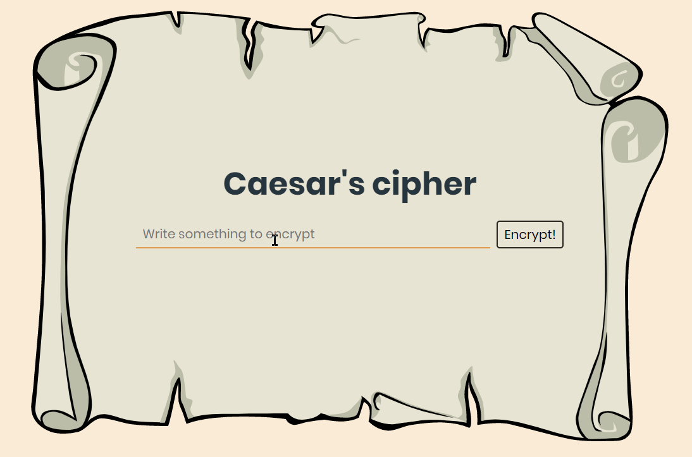

# Caesar's cipher - Opanuj JS project
**This is a practical project from [Opanuj JavaScript](https://przeprogramowani.pl/kurs-javascript?utm_source=landing) course, the project is about creating Caesar's cipher(ROT13).**

## What is Caesar cipher ?

**[From wikipedia: ](https://en.wikipedia.org/wiki/Caesar_cipher)**
>In cryptography, a Caesar cipher, also known as Caesar's cipher, the shift cipher, Caesar's code or Caesar shift, is one of the simplest and most widely known encryption techniques.
It is a type of substitution cipher in which each letter in the plaintext is replaced by a letter some fixed number of positions down the alphabet.
For example, with a left shift of 3, D would be replaced by A, E would become B, and so on.
The method is named after Julius Caesar, who used it in his private correspondence.

So **Caesar's cipher** is a simple data encryption technique, it is based on an offset of letters in the Alphabet. In this project I will use 13-letter offset: [ROT13](https://en.wikipedia.org/wiki/ROT13)

**Example**

Caesar's code by using a **ROT13**

    plain:  PRZEPROGRAMOWANI
    cipher: CEMRCEBTENZBJNAV

    plain:  Adrian
    cipher: Nqevna

    plain:  iLoveHiking
    cipher: vYbirUvxvat

## Preview

## Installing

1. Clone this repo
`git clone https://github.com/adrian-karbowniczyn/caesar-cipher`

2. Go into project folder

2. Make sure you have Node.js with npm from [nodejs.org](https://nodejs.org/en/) or via [nvm](https://github.com/nvm-sh/nvm) | [n](https://github.com/tj/n)

3. Download all needed packages to run properly this project
`npm install -D parcel-bundler eslint@latest prettier eslint-config-prettier eslint-plugin-prettier jest babel-jest @babel/core @babel/preset-env`
`npx install-peerdeps --dev eslint-config-airbnb`

## Usage

 In the project folder run `npm run dev:serve` to start parcel server on http://localhost:5555

## Running the tests

To run all the tests just type ` npm run test`

## Used packages and tools

* [Node.js](https://nodejs.org/en/)
* [npm](https://www.npmjs.com/)
* [Parcel](https://parceljs.org/)
* [Jest](https://jestjs.io/)
* [eslint](https://eslint.org/)
* [prettier](https://prettier.io/)
* [eslint-config-prettier](https://github.com/prettier/eslint-config-prettier)
* [eslint-plugin-prettier](https://github.com/prettier/eslint-plugin-prettier)
* [eslint-config-airbnb](https://www.npmjs.com/package/eslint-config-airbnb)
* [babel-jest](https://www.npmjs.com/package/babel-jest)
* [@babel/core](https://www.npmjs.com/package/@babel/core)
* [@babel/preset-env](https://babeljs.io/docs/en/babel-preset-env)
